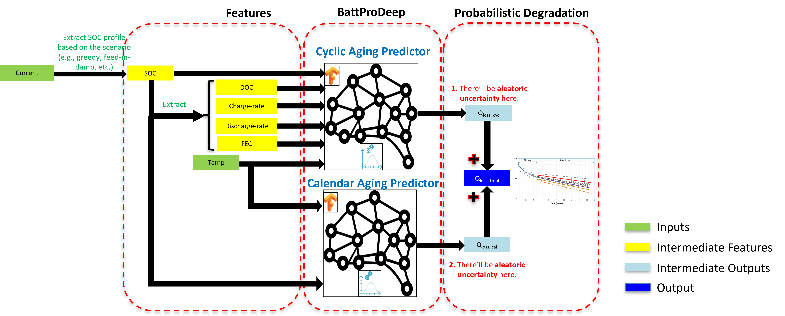

# BattProDeep

## Description:

<p align="center">
  
</p>

Welcome to "BattProDeep" – a specialized repository dedicated to advancing the prediction of lithium-ion battery aging through sophisticated probabilistic prediction models.

The following figure displays the details of BattProDeep:

<p align="center">
  
</p>

## Preprint Version

This tool has been accepted to be presented at the [**NEIS 2024**](https://neis-conference.com/) conference.  Considering this, the preprint version of the paper explaining this tool is available [here](https://doi.org/10.26434/chemrxiv-2024-5bh40-v2).

If you want to use this tool in your academic work, please cite it as follows:

```plaintext
Heidarabadi H, Graner M, Hesse H. BattProDeep: A Deep Learning-Based Tool for Probabilistic Battery Aging Prediction. ChemRxiv. 2024; doi:10.26434/chemrxiv-2024-5bh40
```

## Key Features:

* **Innovative Modeling**: Utilizing cutting-edge machine learning techniques to accurately model and forecast the aging process of lithium-ion batteries.
* **Battery Health Insights**: Aiming to provide valuable insights into battery health and lifespan, enhancing the reliability and efficiency of lithium-ion batteries in various applications.
* **Data-Driven Approach**: Emphasizing a data-centric methodology to understand and predict the intricate patterns of battery aging.

## Project Goal:

The primary objective of this repository is to develop a robust and accurate predictive model for lithium-ion battery aging. This project seeks to contribute to the sustainable and efficient use of lithium-ion batteries, a critical component in modern electronics, electric vehicles, and renewable energy systems.